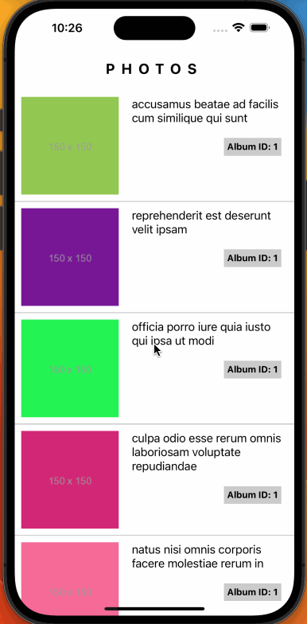

# JsonPlaceholder Photos with Redux

<h1>Mobile Application demonstrating Redux and Axios</h1>

This is a single page mobile application consuming the API at https://jsonplaceholder.typicode.com/photos with axios and managing state with classic Redux. The photo cards are rendered by FlatList.

<h2>Technologies</h2>
<ul>
    <li>React Native</li>
    <li>Axios</li>
    <li>Redux</li>
</ul>
<h3>Screenshot</h3>

